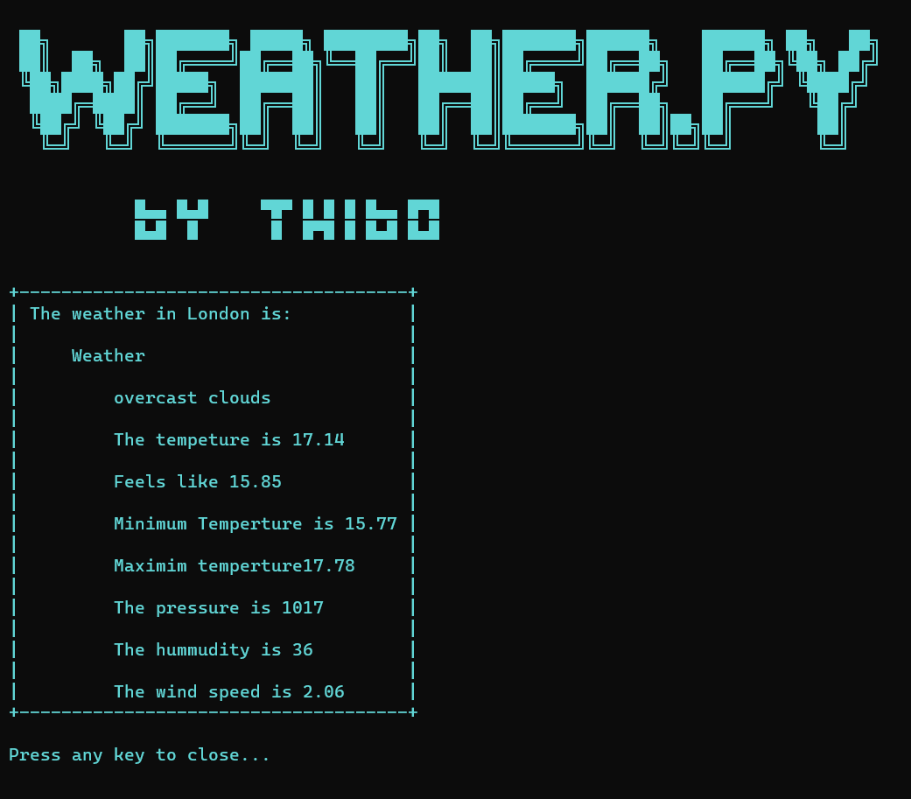

<div id="top"></div>


[![Contributors][contributors-shield]][contributors-url]
[![Forks][forks-shield]][forks-url]
[![Stargazers][stars-shield]][stars-url]
[![Issues][issues-shield]][issues-url]
[![MIT License][license-shield]][license-url]


<!-- PROJECT LOGO -->
<br />
<div align="center">
    
  </a>

<h3 align="center">Weather App</h3>

  <p align="center">
    A simple python program that gets the current weather 
    <br />
    <br />
    <a href="https://github.com/Th1b0/Python-Weather-App/issues">Report Bug</a>
    ·
    <a href="https://github.com/Th1b0/Python-Weather-App/issues">Request Feature</a>
  </p>
</div>


<!-- TABLE OF CONTENTS -->
<details>
  <summary>Table of Contents</summary>
  <ol>
    <li>
      <a href="#about-the-project">About The Project</a>
      <ul>
        <li><a href="#built-with">Built With</a></li>
      </ul>
    </li>
    <li>
      <a href="#getting-started">Getting Started</a>
      <ul>
        <li><a href="#prerequisites">Prerequisites</a></li>
        <li><a href="#installation">Installation</a></li>
      </ul>
    </li>
    <li><a href="#usage">Usage</a></li>
    <li><a href="#license">License</a></li>
    <li><a href="#contact">Contact</a></li>

  </ol>
</details>


<!-- ABOUT THE PROJECT -->
## About The Project


<br>
<br>
In this program you can search for the weather for specific citties or specific cordinates<br>


### Built With

* [Python-3.8.1](https://www.python.org/downloads/release/python-381/)


### Prerequisites

You will need to download the latest version of python
* Python
  ```sh
    https://www.python.org/downloads/
  ```

### Installation


1. Clone the repo
   ```sh
   git clone https://github.com/Th1b0/Python-Weather-App
   ```
2. Change to the directory
   ```sh
   cd Python-Weather-App
   ```
3. Start setup.bat
   ```sh
    setup.bat
   ```


<!-- USAGE EXAMPLES -->
## Usage


 <font size="4">After the setup the program should run automaticaly. If this is not the case run</font>
 ```
 start.bat
 ```
 Everytime you want to start the porgram again run
  ```
 start.bat
 ```
 or
  ```
 python main.py
 ```


<!-- LICENSE -->
## License

Distributed under the MIT License. See `LICENSE.txt` for more information.


<!-- CONTACT -->
## Contact

twitter - [@ThiboDevs](https://twitter.com/ThiboDevs)
github - [@Th1b0](https://github.com/Th1b0)


[project](https://github.com/Th1b0/Python-Weather-App/issues)

<p align="right">(<a href="#top">back to top</a>)</p>


<!-- MARKDOWN LINKS & IMAGES -->
<!-- https://www.markdownguide.org/basic-syntax/#reference-style-links -->
[contributors-shield]: https://img.shields.io/github/contributors/Th1b0/Python-Weather-App.svg?style=for-the-badge
[contributors-url]: https://github.com/Th1b0/Python-Weather-App/graphs/contributors
[forks-shield]: https://img.shields.io/github/forks/Th1b0/Python-Weather-App.svg?style=for-the-badge
[forks-url]: https://github.com/Th1b0/Python-Weather-App/network/members
[stars-shield]: https://img.shields.io/github/stars/Th1b0/Python-Weather-App.svg?style=for-the-badge
[stars-url]: https://github.com/Th1b0/Python-Weather-App/stargazers
[issues-shield]: https://img.shields.io/github/issues/Th1b0/Python-Weather-App.svg?style=for-the-badge
[issues-url]: https://github.com/Th1b0/Python-Weather-App/issues
[license-shield]: https://img.shields.io/github/license/Th1b0/Python-Weather-App.svg?style=for-the-badge
[license-url]: https://github.com/Th1b0/Python-Weather-App/blob/master/LICENSE.txt
[linkedin-shield]: https://img.shields.io/badge/-LinkedIn-black.svg?style=for-the-badge&logo=linkedin&colorB=555
[linkedin-url]: https://linkedin.com/in/linkedin_username
[product-screenshot]: images/screenshot.png